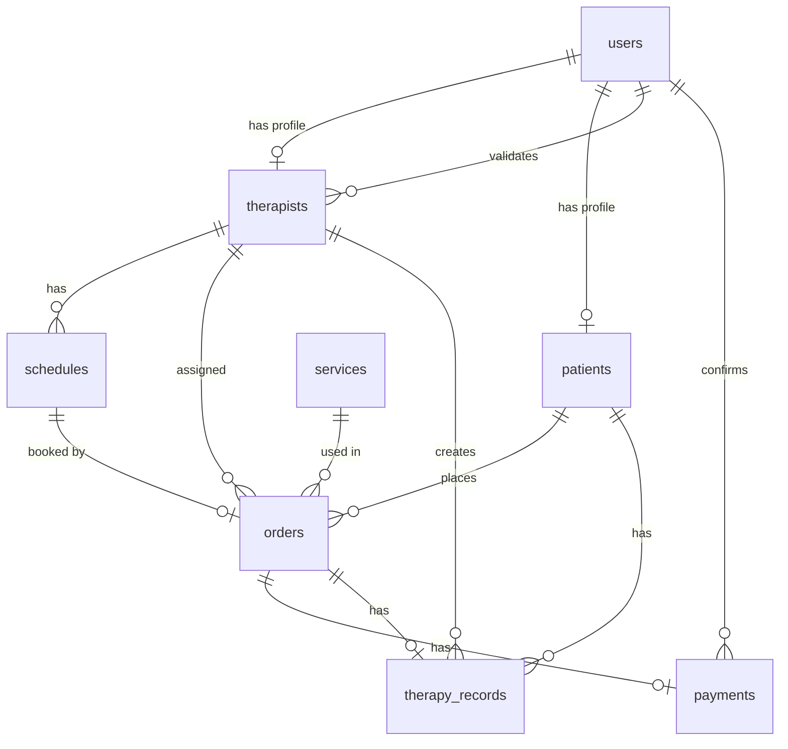

# 📘 Dokumentasi Backend — FisioHomecare API

## 1. Gambaran Umum

**FisioHomecare** adalah platform terintegrasi (Web + Mobile) untuk memudahkan pasien pasca-operasi memesan layanan fisioterapi ke rumah (homecare). Backend ini dibangun menggunakan:

| Teknologi | Versi | Fungsi |
|-----------|-------|--------|
| Node.js | 18+ | Runtime server |
| Express | 5.x | Web framework |
| Sequelize | 6.x | ORM (Object-Relational Mapping) |
| MySQL | 8.x | Database relasional |
| bcrypt | 6.x | Hashing password |
| JWT | 9.x | Token autentikasi |
| Firebase Admin | 13.x | Verifikasi token Firebase (opsional) |
| Google Cloud Storage | 7.x | Penyimpanan file/media |
| Multer | 2.x | Middleware upload file |

---

## 2. Struktur Folder

```
backend/
├── .env                          # Konfigurasi environment
├── .gitignore
├── package.json
├── postman_collection.json       # Import ke Postman
├── postman_environment.json      # Environment Postman
├── homecare-2b018-firebase-*.json # Firebase Service Account
├── uploads/                      # (fallback lokal, utama di GCS)
└── src/
    ├── server.js                 # Entry point
    ├── app.js                    # Express app config
    ├── config/
    │   ├── database.js           # Sequelize config
    │   └── firebase.js           # Firebase Admin init
    ├── models/
    │   ├── index.js              # Model loader + associations
    │   ├── User.js
    │   ├── Therapist.js
    │   ├── Patient.js
    │   ├── Service.js
    │   ├── Schedule.js
    │   ├── Order.js
    │   ├── Payment.js
    │   └── TherapyRecord.js
    ├── controllers/
    │   ├── authController.js
    │   ├── therapistController.js
    │   ├── orderController.js
    │   ├── paymentController.js
    │   ├── recordController.js
    │   ├── serviceController.js
    │   ├── dashboardController.js
    │   └── uploadController.js
    ├── routes/
    │   ├── index.js              # Router utama
    │   ├── authRoutes.js
    │   ├── therapistRoutes.js
    │   ├── orderRoutes.js
    │   ├── paymentRoutes.js
    │   ├── recordRoutes.js
    │   ├── patientRoutes.js
    │   ├── serviceRoutes.js
    │   ├── dashboardRoutes.js
    │   └── uploadRoutes.js
    ├── middleware/
    │   ├── auth.js               # authenticate, authorize, requireValidatedTherapist
    │   ├── upload.js             # Multer (memory storage untuk GCS)
    │   ├── validate.js           # express-validator handler
    │   └── errorHandler.js       # Centralized error handler
    ├── utils/
    │   ├── ApiError.js           # Custom error class
    │   └── ApiResponse.js        # Standardized response
    └── seeders/
        └── seed.js               # Data awal (admin, terapis, pasien, layanan, jadwal)
```

---

## 3. Struktur Database (ERD)

### 3.1 Diagram Relasi



### 3.2 Tabel: `users`

| Kolom | Tipe | Nullable | Keterangan |
|-------|------|----------|------------|
| `id` | UUID (PK) | ❌ | Auto-generated |
| `name` | VARCHAR(100) | ❌ | Nama lengkap |
| `email` | VARCHAR(255) | ❌ | Unique |
| `phone` | VARCHAR(20) | ✅ | No telepon |
| `role` | ENUM | ❌ | `admin`, `therapist`, `patient` |
| `firebase_uid` | VARCHAR(128) | ✅ | Unique, untuk Firebase Auth |
| `password_hash` | VARCHAR(255) | ✅ | Bcrypt hash |
| `created_at` | DATETIME | ❌ | Auto |
| `updated_at` | DATETIME | ❌ | Auto |

### 3.3 Tabel: `therapists`

| Kolom | Tipe | Nullable | Keterangan |
|-------|------|----------|------------|
| `id` | UUID (PK) | ❌ | |
| `user_id` | UUID (FK → users) | ❌ | Unique |
| `license_number` | VARCHAR(50) | ❌ | Nomor STR |
| `license_doc_url` | VARCHAR(500) | ✅ | URL dokumen lisensi di GCS |
| `photo_url` | VARCHAR(500) | ✅ | URL foto profil |
| `specialization` | VARCHAR(100) | ✅ | Spesialisasi (Ortopedi, Neurologi, dll) |
| `status` | ENUM | ❌ | `pending`, `active`, `suspended` |
| `validated_by` | UUID (FK → users) | ✅ | Admin yang memvalidasi |
| `validated_at` | DATETIME | ✅ | Waktu validasi |
| `rating` | DECIMAL(3,2) | ❌ | Default 0.00, range 0-5 |

### 3.4 Tabel: `patients`

| Kolom | Tipe | Nullable | Keterangan |
|-------|------|----------|------------|
| `id` | UUID (PK) | ❌ | |
| `user_id` | UUID (FK → users) | ❌ | Unique |
| `address` | TEXT | ✅ | Alamat rumah |
| `medical_history` | TEXT | ✅ | Riwayat medis |
| `emergency_contact` | VARCHAR(100) | ✅ | Kontak darurat |
| `dob` | DATE | ✅ | Tanggal lahir |

### 3.5 Tabel: `services`

| Kolom | Tipe | Nullable | Keterangan |
|-------|------|----------|------------|
| `id` | UUID (PK) | ❌ | |
| `name` | VARCHAR(100) | ❌ | Nama layanan |
| `description` | TEXT | ✅ | Deskripsi layanan |
| `price` | DECIMAL(12,2) | ❌ | Harga (Rp) |
| `duration_minutes` | INT | ❌ | Default 60 |
| `is_active` | BOOLEAN | ❌ | Default true |

### 3.6 Tabel: `schedules`

| Kolom | Tipe | Nullable | Keterangan |
|-------|------|----------|------------|
| `id` | UUID (PK) | ❌ | |
| `therapist_id` | UUID (FK → therapists) | ❌ | |
| `date` | DATE | ❌ | Tanggal jadwal |
| `start_time` | TIME | ❌ | Jam mulai |
| `end_time` | TIME | ❌ | Jam selesai (harus > start_time) |
| `is_booked` | BOOLEAN | ❌ | Default false |

### 3.7 Tabel: `orders`

| Kolom | Tipe | Nullable | Keterangan |
|-------|------|----------|------------|
| `id` | UUID (PK) | ❌ | |
| `patient_id` | UUID (FK → patients) | ❌ | |
| `therapist_id` | UUID (FK → therapists) | ❌ | |
| `schedule_id` | UUID (FK → schedules) | ❌ | |
| `service_id` | UUID (FK → services) | ✅ | |
| `service_type` | VARCHAR(100) | ✅ | Deskripsi teks layanan |
| `address` | TEXT | ❌ | Alamat kunjungan |
| `lat` | DECIMAL(10,8) | ✅ | Latitude |
| `lng` | DECIMAL(11,8) | ✅ | Longitude |
| `status` | ENUM | ❌ | `pending`, `confirmed`, `otw`, `ongoing`, `done`, `cancelled` |
| `document_url` | VARCHAR(500) | ✅ | Foto kondisi pasien |
| `notes` | TEXT | ✅ | Catatan tambahan |

### 3.8 Tabel: `payments`

| Kolom | Tipe | Nullable | Keterangan |
|-------|------|----------|------------|
| `id` | UUID (PK) | ❌ | |
| `order_id` | UUID (FK → orders) | ❌ | Unique (1 order = 1 payment) |
| `amount` | DECIMAL(12,2) | ❌ | Nominal pembayaran |
| `method` | ENUM | ❌ | `transfer`, `cash` |
| `status` | ENUM | ❌ | `pending`, `confirmed`, `rejected` |
| `proof_url` | VARCHAR(500) | ✅ | URL bukti transfer di GCS |
| `confirmed_by` | UUID (FK → users) | ✅ | Admin yang konfirmasi |
| `paid_at` | DATETIME | ✅ | Waktu bayar |

### 3.9 Tabel: `therapy_records`

| Kolom | Tipe | Nullable | Keterangan |
|-------|------|----------|------------|
| `id` | UUID (PK) | ❌ | |
| `order_id` | UUID (FK → orders) | ❌ | Unique |
| `therapist_id` | UUID (FK → therapists) | ❌ | |
| `patient_id` | UUID (FK → patients) | ❌ | |
| `chief_complaint` | TEXT | ✅ | Keluhan utama |
| `diagnosis` | TEXT | ✅ | Diagnosis terapis |
| `actions_taken` | TEXT | ✅ | Tindakan yang dilakukan |
| `session_number` | INT | ❌ | Default 1 |
| `check_in_at` | DATETIME | ✅ | Waktu mulai sesi |
| `check_out_at` | DATETIME | ✅ | Waktu selesai sesi |

---

## 4. Autentikasi & Otorisasi

### 4.1 Mekanisme Auth

Backend mendukung **dua metode** autentikasi:

1. **Firebase Auth (Produksi)**: Token Firebase ID dikirim dari mobile/web → backend verifikasi via Firebase Admin SDK.
2. **JWT Fallback (Development)**: Login via email/password → backend generate JWT → kirim di header `Authorization: Bearer <token>`.

### 4.2 Role & Hak Akses

| Role | Hak Akses |
|------|-----------|
| `admin` | Semua endpoint, validasi terapis, kelola layanan, konfirmasi pembayaran, dashboard |
| `therapist` | Lihat order sendiri, update status order, input rekam terapi, upload foto (harus sudah divalidasi admin) |
| `patient` | Buat order, lihat order sendiri, pembayaran, upload bukti/foto, lihat rekam terapi sendiri |

### 4.3 Middleware `requireValidatedTherapist`

Terapis dengan status `pending` atau `suspended` **diblokir** dari aksi berikut:
- Update status order
- Buat/hapus jadwal
- Input rekam terapi
- Upload foto sesi

Terapis tetap bisa login dan upload dokumen lisensi (STR) untuk proses validasi.

---

## 5. API Endpoints

**Base URL**: `http://localhost:3000/v1`

### 5.1 Auth (`/v1/auth`)

| Method | Endpoint | Auth | Role | Body | Keterangan |
|--------|----------|------|------|------|------------|
| POST | `/auth/register` | ❌ | — | `name`, `email`, `password`, `phone`, `role`, + profil | Register pasien/terapis |
| POST | `/auth/login` | ❌ | — | `email`, `password` | Login → dapat token |
| GET | `/auth/me` | ✅ | Semua | — | Lihat profil sendiri |

### 5.2 Therapists (`/v1/therapists`)

| Method | Endpoint | Auth | Role | Keterangan |
|--------|----------|------|------|------------|
| GET | `/therapists` | ✅ | Semua | List terapis (filter: `status`, `specialization`) |
| GET | `/therapists/:id` | ✅ | Semua | Detail terapis |
| PUT | `/therapists/:id/validate` | ✅ | Admin | Validasi terapis (`active` / `suspended`) |
| GET | `/therapists/:id/schedules` | ✅ | Semua | Lihat jadwal terapis (filter: `date`, `is_booked`) |
| POST | `/therapists/:id/schedules` | ✅ | Admin, Terapis* | Buat slot jadwal baru |
| DELETE | `/therapists/:id/schedules/:sid` | ✅ | Admin, Terapis* | Hapus slot jadwal |

> \* Terapis harus sudah divalidasi (status: `active`)

### 5.3 Services/Layanan (`/v1/services`)

| Method | Endpoint | Auth | Role | Keterangan |
|--------|----------|------|------|------------|
| GET | `/services` | ✅ | Semua | List semua layanan |
| GET | `/services/:id` | ✅ | Semua | Detail layanan |
| POST | `/services` | ✅ | Admin | Buat layanan baru |
| PUT | `/services/:id` | ✅ | Admin | Update layanan |
| DELETE | `/services/:id` | ✅ | Admin | Hapus layanan |

### 5.4 Orders (`/v1/orders`)

| Method | Endpoint | Auth | Role | Keterangan |
|--------|----------|------|------|------------|
| GET | `/orders` | ✅ | Semua | List order (auto-filter per role) |
| POST | `/orders` | ✅ | Pasien | Buat order baru |
| GET | `/orders/:id` | ✅ | Semua | Detail order |
| PUT | `/orders/:id/status` | ✅ | Admin, Terapis* | Update status order |
| DELETE | `/orders/:id` | ✅ | Semua | Batalkan order |

**Alur Status Order:**
```
pending → confirmed → otw → ongoing → done
   ↓          ↓         ↓
cancelled  cancelled  cancelled
```

### 5.5 Payments (`/v1/payments`)

| Method | Endpoint | Auth | Role | Keterangan |
|--------|----------|------|------|------------|
| POST | `/payments/initiate` | ✅ | Pasien | Kirim pembayaran + bukti |
| PUT | `/payments/:order_id/confirm` | ✅ | Admin | Konfirmasi/tolak pembayaran |
| GET | `/payments/:order_id` | ✅ | Semua | Lihat status pembayaran |

### 5.6 Therapy Records (`/v1/records`)

| Method | Endpoint | Auth | Role | Keterangan |
|--------|----------|------|------|------------|
| POST | `/records` | ✅ | Terapis* | Input rekam terapi |
| GET | `/records/:id` | ✅ | Semua | Detail rekam terapi |
| GET | `/patients/:id/records` | ✅ | Semua | Riwayat rekam pasien |

### 5.7 Upload (`/v1/upload`)

File disimpan ke **Google Cloud Storage** (`homecare-2b018.appspot.com`).

| Method | Endpoint | Auth | Role | Field | Keterangan |
|--------|----------|------|------|-------|------------|
| POST | `/upload/license` | ✅ | Terapis | `file` | Upload dokumen STR |
| POST | `/upload/payment` | ✅ | Pasien | `file` | Upload bukti transfer |
| POST | `/upload/photo` | ✅ | Pasien, Terapis* | `file` | Upload foto kondisi |
| POST | `/upload/document` | ✅ | Semua | `file` | Upload dokumen umum |
| POST | `/upload/photos` | ✅ | Pasien, Terapis* | `files` | Upload multi foto (max 5) |

> Format yang diterima: JPG, PNG, PDF. Max 10MB per file.

### 5.8 Dashboard Admin (`/v1/dashboard`)

| Method | Endpoint | Auth | Role | Keterangan |
|--------|----------|------|------|------------|
| GET | `/dashboard/stats` | ✅ | Admin | Statistik (total order, revenue, terapis aktif/pending) |
| GET | `/dashboard/orders` | ✅ | Admin | Monitor semua order (filter: `status`, `date`, `therapist_id`) |

---

## 6. Format Response API

### 6.1 Sukses
```json
{
  "success": true,
  "message": "Login successful",
  "data": { ... }
}
```

### 6.2 Sukses dengan Pagination
```json
{
  "success": true,
  "message": "Orders retrieved successfully",
  "data": [ ... ],
  "pagination": {
    "total": 25,
    "page": 1,
    "limit": 10,
    "totalPages": 3
  }
}
```

### 6.3 Error
```json
{
  "success": false,
  "message": "Invalid email or password"
}
```

---

## 7. Cara Setup & Menjalankan

### 7.1 Prasyarat
- Node.js v18+
- MySQL 8+ (database `fisiohomecare` harus sudah dibuat)
- (Opsional) Firebase project dengan Storage aktif

### 7.2 Instalasi
```bash
cd backend
npm install
```

### 7.3 Konfigurasi `.env`
```env
PORT=3000
NODE_ENV=development

DB_HOST=localhost
DB_PORT=3306
DB_NAME=fisiohomecare
DB_USER=root
DB_PASSWORD=
DB_DIALECT=mysql

FIREBASE_SERVICE_ACCOUNT=./homecare-2b018-firebase-adminsdk-fbsvc-44e32df7a4.json
GCS_BUCKET_NAME=homecare-2b018.appspot.com

JWT_SECRET=dev_secret_key_change_in_production
```

### 7.4 Seed Database
```bash
npm run seed
```
Ini akan membuat semua tabel dan mengisi data awal:
- **Admin**: admin@fisiohomecare.com / admin123
- **Terapis**: budi@fisiohomecare.com / therapist123
- **Pasien**: andi@gmail.com / patient123
- **5 Layanan** fisioterapi
- **5 Slot jadwal** untuk terapis

### 7.5 Jalankan Server
```bash
npm run dev      # Development (auto-reload)
npm start        # Production
```

Server berjalan di `http://localhost:3000`

---

## 8. Testing dengan Postman

### 8.1 Import
1. Buka Postman → **Import** → pilih `postman_collection.json`
2. Buka **Environments** → **Import** → pilih `postman_environment.json`
3. Pilih environment **"FisioHomecare - Local"** di dropdown kanan atas

### 8.2 Urutan Testing
Token dan ID otomatis tersimpan ke environment variable setiap kali request berhasil:

```
1. Login Admin        → token tersimpan otomatis
2. Login Therapist    → therapist_token tersimpan
3. Login Patient      → patient_token tersimpan
4. List Therapists    → therapist_id tersimpan
5. Get Schedules      → schedule_id tersimpan
6. List Services      → service_id tersimpan
7. Create Order       → order_id tersimpan
8. Initiate Payment
9. Confirm Payment
10. Create Record
```

---

## 9. Keamanan

| Fitur | Implementasi |
|-------|-------------|
| Password Hashing | bcrypt (salt rounds: 10) |
| Token Auth | JWT (expired: 24 jam) |
| HTTP Security Headers | helmet |
| CORS | Dikonfigurasi via `.env` |
| Input Validation | express-validator |
| Role-Based Access | Middleware `authorize()` |
| Therapist Validation Gate | Middleware `requireValidatedTherapist` |
| Sensitive Data Protection | `toSafeJSON()` menghapus `password_hash` dari response |

---

## 10. Dependensi

### Production
| Package | Fungsi |
|---------|--------|
| express | Web framework |
| sequelize | ORM |
| mysql2 | MySQL driver |
| bcrypt | Password hashing |
| jsonwebtoken | JWT auth |
| firebase-admin | Firebase Auth verification |
| @google-cloud/storage | Upload file ke GCS |
| multer | File upload middleware |
| cors | Cross-Origin Resource Sharing |
| helmet | HTTP security headers |
| morgan | Request logging |
| express-validator | Input validation |
| dotenv | Environment variables |
| uuid | UUID generation |

### Development
| Package | Fungsi |
|---------|--------|
| nodemon | Auto-reload server |
| sequelize-cli | Database migration tools |
